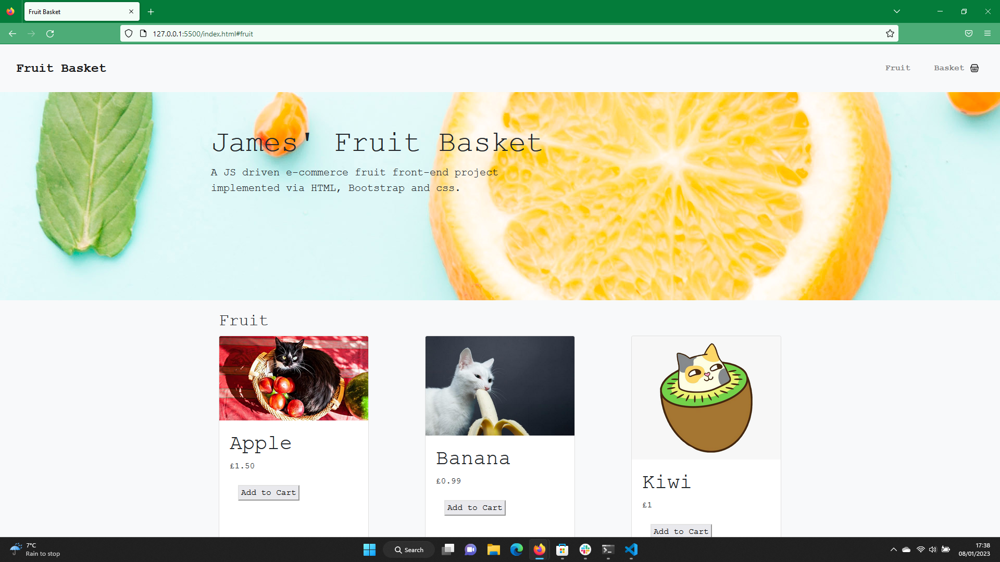

## Fruit Basket

## Description

The fruit basket is a JS driven mobile-friendly e-commerce front-end project implemented via HTML, Bootstrap and css. I used a combination of HTML attributes, CSS/Bootstrap styling and javascript features to add interactivity via js DOM.

My main motivation for creating the fruit basket was to have a project allowing me to combine all of my HTML, CSS, Bootstrap and vanilla Javascript skills. I wanted to build a project that would allow me to practice and develop all of these skills as well as showcase them in clear and simple environment, creating an e-commerce web application with js driven features allowed me to do whilst creating an application that mirrors a feaure that has a real world use case. 

In building this project I developed and polished my front-end web skills, tying together HTML, CSS and javascript to create a functioning website, implementing functions for interactivity and objects to store date. 

## Installation

N/A.

## Usage

The deployed site has an intuitive design with a navigation bar and various buttons that allow the used to interact with product values and navigate to a shopping cart and sections associated with an e-commerce page. For full userbility please add products to the cart, clear the cart, clear individual items and click 'Proceed to Payment' and 'Submit' within modal to access all features.

## Credits

N/A.

## License

please see license file in main branch of gitHub repository.

## Features

* Add Items to basket
* 'Basket Empty' message and products visibilty toggled within basket
* Change Quantity of Items within basket
* Clear individual items from basket
* Clear entire basket
* Total price stored in JS object and displayed on page
* Basket opens in Modal via 'Proceed to Payment' button
* Form to sign in and pay (front-end only) within modal
* Thank you message on final 'Submit' button in modal
* Mobile Friendly
* Implementation of JS objects, loops, arrays, conditional statements & functions tied into HTML and CSS using DOM and CSSDOM

## Deployed Site

https://jamesrobertsutcliffe.github.io/fruit-basket/

